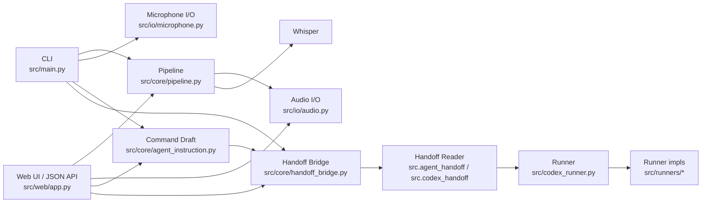
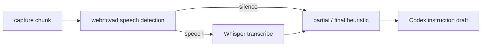
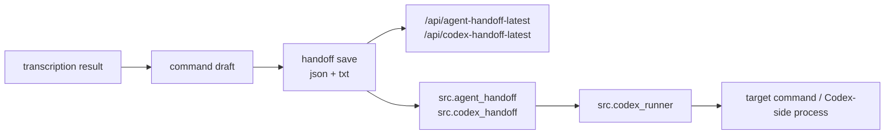

# ai_core

Whisper を使ってローカル音声ファイルを文字起こしする最小構成です。
現在は `file input -> Whisper -> text`、固定時間の `mic -> Whisper -> text`、および簡易ループの `mic-loop -> Whisper -> text` を対象にしています。内部の共通経路は `capture -> buffer -> transcribe` へ寄せ始めています。

## Overview

- 今できること: ファイル入力、固定時間マイク入力、簡易マイクループ、Web UI、JSON API、軽い無音トリム、Codex 指示草案出力
- まだできないこと: 真のリアルタイム streaming、`partial/final` の本格運用、VAD
- 位置づけ: GUI 主体ではなく、音声入力フロントエンド兼サービス境界を優先
- ブラウザ録音の `webm` はサーバー側で `16kHz mono wav` 相当に正規化してから転写
- Web UI の言語入力欄は既定で `ja`
- `HD Pro Webcam C920` で録音確認済み

### Architecture



### Mic-loop Flow



### Codex Handoff Flow



## Requirements

- Ubuntu 22.04
- Python 3.11.15
- 仮想環境は `.venv` を使用
- パッケージ管理は `uv` を使用
- `ffmpeg` がシステムに導入済みであること
- GPU は任意です
- 現在の開発環境では CUDA 利用を確認済みです

## Repository stance

- このリポジトリは現時点では `~/projects/ai_core` に置く前提です
- `~/dev` に移すのは、複数プロジェクトから参照する共通基盤へ育った段階で再検討します
- いまは「AI 基盤そのもの」より「AI 入力と handoff を育てる開発・実験本体」として扱います

## Runtime notes

- 現在の確認環境では `torch 2.10.0+cu128`, `torch.cuda.is_available() == True` でした
- GPU 利用は PyTorch の CUDA 対応ビルドと NVIDIA ドライバが正しく揃っていることが前提です
- `pyproject.toml` では Torch の CUDA バリアントを固定していないため、別マシンでは CPU 版 Torch が入る可能性があります
- CPU 版 Torch が入った場合でも CLI は動作しますが、Whisper は CPU fallback で遅くなります
- CUDA デバイスが一時的に busy / unavailable の場合も、モデル読み込み時は CPU fallback を試みます

## Setup

依存同期:

```bash
uv sync
```

smoke test 実行:

```bash
uv run python smoke_test.py
```

補足:

- `smoke_test.py` は CLI / Web UI / JSON API のサーバー側動作を確認します
- ブラウザ録音の 2 回連続実行は実ブラウザ依存なので、別途手動確認が必要です

Web UI 起動:

```bash
uv run python -m src.web.app
```

JSON API 例:

```bash
curl -X POST http://127.0.0.1:8000/api/transcribe-upload \
  -F "audio_file=@data/sample_audio.mp3" \
  -F "model=small" \
  -F "language=ja"
```

応答 JSON には `transcript` に加えて `command` が含まれます。

`command_only=true` を送ると、`transcript` を空にして `command` を主に返せます。

```bash
curl -X POST http://127.0.0.1:8000/api/transcribe-upload \
  -F "audio_file=@data/sample_audio.mp3" \
  -F "model=small" \
  -F "language=ja" \
  -F "command_only=true"
```

`save_command=true` を送ると、プロジェクト内 `.cache/codex/web_latest.json` と `.cache/codex/web_latest.txt` に handoff を保存し、応答 JSON に `command_path` と `command_text_path` を返します。

保存済み handoff を取得:

```bash
curl http://127.0.0.1:8000/api/codex-handoff-latest?source=web
```

ローカル CLI から最新 handoff を読む:

```bash
uv run python -m src.codex_handoff --source web --format prompt
```

互換性を保ったまま、より汎用的な入口も使えます。内部では `src/core/handoff_bridge.py`, `src/core/agent_instruction.py`, `src/runners/agent.py` を参照し始めていますが、既存の `src/core/codex_bridge.py`, `src/core/llm.py`, `src/runners/codex.py` は互換のため残しています。

```bash
curl http://127.0.0.1:8000/api/agent-handoff-latest?source=web
uv run python -m src.agent_handoff --source web --format prompt
uv run python -m src.agent_runner --source web --template cat
```

任意コマンドの stdin に最新 handoff を渡す:

```bash
uv run python -m src.codex_runner --source web -- python -c "import sys; print(sys.stdin.read())"
```

組み込みテンプレートを使う:

```bash
uv run python -m src.codex_runner --source web --template cat
```

Codex CLI にそのまま渡す:

```bash
uv run python -m src.codex_runner --source web --template codex-exec
```

このテンプレートは `codex` コマンドが `PATH` にある前提です。見つからない場合は実行前に入力エラーを返します。

## Quick start

```bash
uv run python -m src.main data/sample_audio.mp3 --language ja
```

```bash
uv run python -m src.main --mic --duration 5 --language ja
```

```bash
uv run python -m src.main --mic-loop --duration 3 --language ja
```

`Ctrl+C` で停止した場合も、直前の安定した発話は `final` として 1 回だけ flush を試みます。
また、十分に長い同一発話は 2 回連続でも `final` に寄せます。短い断片は引き続き厳しめです。
必要なら `--vad-aggressiveness 0..3` で WebRTC VAD のしきい値を調整できます。
さらに、中くらい以上の発話は安定時間が十分長ければ `final` に寄せます。
この安定時間は `--final-stable-seconds` で調整できます。
ただし、時間条件だけで単発チャンクを即 `final` にすることは避け、最低限の反復を前提にしています。
これらの `final` ヒューリスティクスは `src/core/finalization.py` に切り出し、CLI 本体から分離しています。

転写結果と Codex 用の指示草案を同時に表示:

```bash
uv run python -m src.main --mic --duration 5 --language ja --emit-command
```

Codex 用の指示草案だけ表示:

```bash
uv run python -m src.main --mic --duration 5 --language ja --command-only
```

Codex 連携用 payload を JSON 保存:

```bash
uv run python -m src.main --mic --duration 5 --language ja --command-output .cache/codex/latest.json
```

このとき `.txt` 版の prompt も同じ場所に自動生成します。中身は `Voice transcript` と `Requested task` を含む、そのまま Codex に渡しやすい形式です。

Web UI でも、アップロード欄とブラウザ録音欄の `Codex 指示草案を優先して返す` を有効にすると `command_only` と同じ挙動になります。
`Codex payload を保存する` を有効にすると、同じ handoff を `.cache/codex/web_latest.json` と `.cache/codex/web_latest.txt` に保存します。

ブラウザ GUI を起動:

```bash
uv run python -m src.web.app
```

起動後に `http://127.0.0.1:8000` を開きます。

このマシンでは `--mic-device` を省略した場合、`arecord -l` で見つかった最初の入力デバイスを優先します。

## Usage

基本実行:

```bash
uv run python -m src.main /path/to/audio.wav
```

言語指定:

```bash
uv run python -m src.main /path/to/audio.wav --language ja
```

モデル変更:

```bash
uv run python -m src.main /path/to/audio.wav --model base
```

マイク録音:

```bash
uv run python -m src.main --mic --duration 5 --language ja
```

マイクループ:

```bash
uv run python -m src.main --mic-loop --duration 3 --language ja
```

VAD の強さを変える:

```bash
uv run python -m src.main --mic-loop --duration 3 --language ja --vad-aggressiveness 3
```

`final` に寄せる安定時間を変える:

```bash
uv run python -m src.main --mic-loop --duration 3 --language ja --final-stable-seconds 6
```

2 回だけループして確認:

```bash
uv run python -m src.main --mic-loop --duration 3 --iterations 2 --language ja
```

マイクデバイス指定:

```bash
uv run python -m src.main --mic --duration 5 --mic-device plughw:2,0 --language ja
```

無音トリムを無効化:

```bash
uv run python -m src.main --mic --duration 5 --no-trim-silence --language ja
```

サンプル音声:

```bash
uv run python -m src.main data/sample_audio.mp3 --language ja
```

手元で録音した wav を文字起こし:

```bash
uv run python -m src.main data/mic_speech_test_c920_retry.wav --language ja
```

## Directory structure

```text
ai_core/
├── data/                # 入力音声サンプル
├── models/whisper/      # Whisper モデル保存先
├── src/core/pipeline.py # capture -> buffer -> transcribe の共通経路
├── src/main.py          # CLI エントリポイント
├── src/io/audio.py      # 音声文字起こし
├── src/io/microphone.py # 固定時間マイク録音
├── src/web/app.py       # ローカル Web UI
├── MEMORY.md            # 長期前提・設計判断
├── REVIEW.md            # レビュー結果
├── REVIEWER_INSTRUCTIONS.md # レビュアー向け記録ルール
├── SHARE_NOTE.md        # 共有用の現在地メモ
└── LOG.md               # 実行履歴
```

Whisper のモデルは `models/whisper` に保存されます。

## 入出力

- 入力: ローカル音声ファイル、固定時間のマイク録音、または簡易マイクループ
- 対応拡張子: `.mp3`, `.wav`, `.m4a`, `.mp4`, `.mpeg`, `.mpga`, `.webm`
- 出力: 文字起こし結果を標準出力へ表示
- `--emit-command` 使用時は Codex 用の指示草案も標準出力へ表示
- `--command-only` 使用時は転写本文を省いて指示草案だけを表示
- `--command-output` 使用時は `{"transcript": "...", "command": "..."}` の JSON を保存
- 既定モデル: `small`

## Model storage

- Whisper のモデルは `models/whisper` に保存されます
- モデルファイルは容量が大きいため、VCS 管理対象外にします
- プロジェクトごとにモデルを持つ方針なので、複数プロジェクトで Whisper を使うと保存容量は重複します

## サンプル結果

入力:
- `data/sample_audio.mp3`

出力例:

```text
こんにちは、温度区さんです。 より自然で、より人間らしい声になりました。
```

マイク録音テストでは文字起こしパイプライン自体は成功していますが、結果の安定化には前処理が必要です。

## Notes / limitations

- 初回実行時は Whisper モデルをダウンロードします
- GPU が使える環境では CUDA を利用します
- GPU が使えない場合は CPU 実行になります
- `ffmpeg` が無い環境では文字起こしに失敗します
- マイク入力は固定時間録音の反復であり、真のストリーミング処理ではありません
- 録音音声は `ffmpeg` の `silenceremove` で軽く前後トリムできます
- `--mic-loop` では `webrtcvad` でほぼ無音のチャンクを軽くスキップします
- 無音チャンクは CLI では `[silence N] silence detected` と表示します
- `AudioBuffer` は入っていますが、`buffer -> partial/final` の扱いはまだ未実装です
- `--mic-loop` では通常チャンクを `partial` として表示し、有限ループの最後または同一結果の連続時に `final` へ寄せます
- 短すぎる断片は `partial` のままにして、誤認識を `final` に寄せにくくしています
- 同じ結果がある程度安定したあとに無音チャンクが来た場合は、その直前の発話を `final` として扱います
- `final` へ寄せるには、同じ結果が複数回連続する必要があります
- 発話区間検出としての VAD は未実装です
- ブラウザ録音の連続実行は smoke test では拾えないため、実ブラウザでの確認が必要です

## Manual checks

- Web UI でブラウザ録音を 2 回連続で実行する
- 1 回目の録音後に `録音開始` が再び押せることを確認する
- 2 回目の録音後も結果更新とエラー表示が正常に動くことを確認する
- `Recorder Debug` に `state`, `chunks`, `lastBlobSize` が妥当な値で出ることを確認する

## Troubleshooting

エラー種別:

- `Input error`: ファイルパス、拡張子、モデル名、CLI 引数の入力不備
- `Environment error`: `ffmpeg` / `arecord` 不在、モデルロード失敗、無音トリム失敗、CUDA 実行環境不備
- `Transcription error`: Whisper 実行中の失敗

- `Input error: audio file not found`
  指定したファイルパスを確認してください
- `Input error: unsupported audio file extension`
  対応拡張子のファイルを使用してください
- `Input error: invalid Whisper model name`
  `small`, `base` など有効なモデル名を指定してください
- `Environment error: ffmpeg is not installed or not found in PATH`
  `ffmpeg` が利用可能か確認してください
- `Environment error: arecord is not installed or not found in PATH`
  `arecord` が利用可能か確認してください
- `Environment error: failed to list microphone devices: ...`
  `arecord -l` が成功するか確認してください
- `Environment error: microphone recording failed: ...`
  デバイス名やマイク接続状態を確認してください
- `Environment error: silence trimming failed: ...`
  `ffmpeg` が利用可能か、入力 wav が壊れていないか確認してください
- `Environment error: failed to load Whisper model ...`
  モデル取得や CUDA 実行環境を確認してください
- `Ctrl+C`
  `--mic-loop` の停止に使用します
- GPU が使えない環境では CPU fallback で遅くなる場合があります
- `uv run python -c "import torch; print(torch.__version__, torch.cuda.is_available(), torch.version.cuda)"`
  で現在の Torch / CUDA 状態を確認できます

## Recording files

- `MEMORY.md`: 長期的に残す前提、設計方針、運用ルール
- `REVIEW.md`: レビュアーの所見、懸念点、改善提案
- `REVIEWER_INSTRUCTIONS.md`: レビュアーへ渡す記録ルール
- `SHARE_NOTE.md`: 現在の状況、次の作業、引き継ぎ事項
- `LOG.md`: 実行コマンド、結果、失敗、確認日時

## 今後の予定

- 出力確定方針の整理
- VAD
- ノイズ対策
- 真のリアルタイム処理
